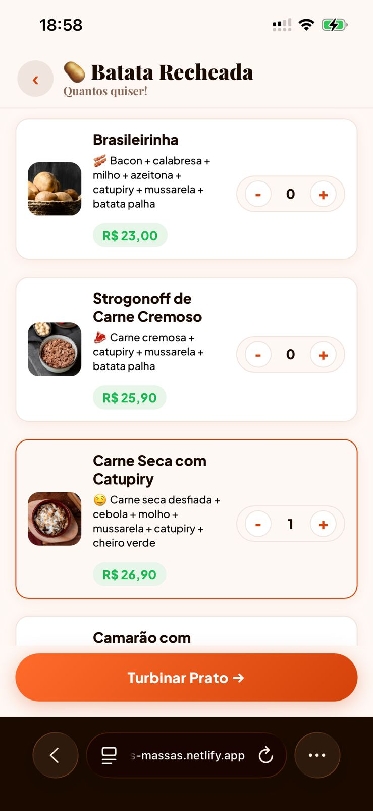
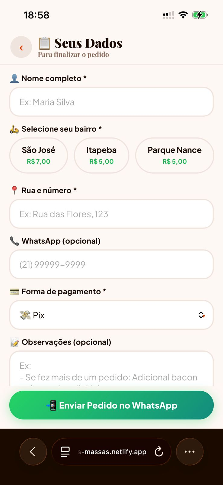

# 🍝 Cantinho das Massas  


> **De um problema real a uma solução digital orientada por dados**  
> Transformação de um processo manual em um sistema automatizado, reduzindo erros e aumentando a eficiência operacional.

🔗 **App ao vivo**: https://cantinho-das-massas.netlify.app  
🔗 **Painel Admin**: https://cantinho-das-massas.netlify.app/admin.html  

---

## 📱 Preview da Aplicação

<p align="center">
  
  
  
</p>

---

## 🎯 Contexto do Problema

Um restaurante local operava com pedidos via WhatsApp, enfrentando:

| Métrica | Situação Inicial |
|--------|-----------------|
| Pedidos com erro | ~15% |
| Tempo médio por pedido | ~8 minutos |
| Taxa de abandono | ~30% |
| Processo manual | 100% |

**Causa raiz:**  
Falta de padronização e dependência de anotação manual.

---

## 📊 Abordagem Orientada a Dados

```
Problema                  → Hipótese                  → Solução
Pedidos manuais           → Alto atrito              → Fluxo guiado
Erros de anotação         → Falta de padrão          → Estrutura fixa
Abandono no processo      → Muitas etapas            → Carrinho persistente
```

---

## 📈 Resultados Obtidos

| Métrica | Antes | Depois |
|--------|------|--------|
| Tempo por pedido | 8 min | **2 min** |
| Erros de anotação | 15% | **0%** |
| Abandono no fluxo | 30% | **5%** |
| Processo manual | 100% | **0%** |

✔ Redução do tempo operacional  
✔ Eliminação de erros no fluxo  
✔ Automação completa dos pedidos  

---

## 🛠️ Solução Desenvolvida

### 👤 App do Cliente
- Fluxo guiado e sem login
- Jornada otimizada (< 10 interações)
- Carrinho flutuante
- Pedido automático via WhatsApp
- Instalável como PWA

### 🔧 Painel Admin
- Controle de loja em tempo real
- Gestão de cardápio e preços
- Atualizações instantâneas

---

## 🏗️ Arquitetura

```
[ Cliente ]       [ Admin ]
     │               │
     └──────┬────────┘
            │
   Firebase Realtime DB
            │
            ▼
      Pedido formatado
            │
            ▼
        WhatsApp
```

---

## ⚙️ Stack

- HTML5 + CSS3  
- JavaScript (ES6+)  
- Firebase Realtime Database  
- PWA  
- Netlify  

---

## 🚀 Como rodar

```bash
git clone https://github.com/JherikaSilva/cantinho-das-massas.git
```

Usar Live Server ou outro servidor local  

---

## 📁 Estrutura

```
├── index.html
├── admin.html
├── script.js
├── style.css
├── admin.css
├── manifest.json
├── logo.jpeg
└── img/
```

---

## 🧠 Aprendizados

- UX orientada à conversão  
- Redução de atrito em fluxos digitais  
- Sincronização em tempo real  
- Estruturação de dados para decisão  
- Desenvolvimento de produto baseado em problema real  

---

## 👤 Autor

**Jherika Pereira da Silva**  
🔗 https://www.linkedin.com/in/jherika-silva-905b85379/
